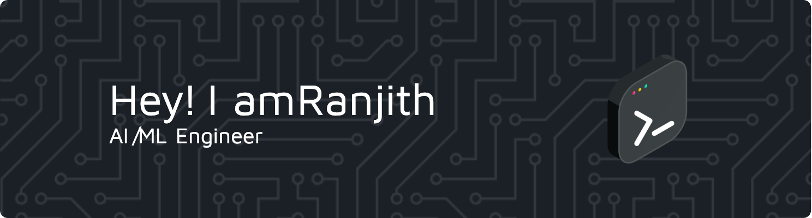

<!-- Banner Image (Replace the URL with your own banner image) -->

# Hi, I'm Ranjith! 👋

## About Me
I'm a NUS undergrad passionate about engineering, data science, and AI. I have a keen interest in financial markets and crypto.  
Currently, I'm working on sentiment analysis, LLMs, and LangChain while building my expertise in software engineering.

**Interests:** Software Development, Financial Markets, Crypto, Data Science, AI  
**Studying:** NUS Undergraduate  
**Career:** Engineer, Data Scientist, AI Enthusiast

---

## Tech Stack

### Languages
 
 
 
 
 
 
 

### Front-End & Web Development
 
 
 

### Back-End & Frameworks
 
 
 

### Databases & Cloud
 
 
 
 
 
 

### Data Science & AI
 
 
 
 
 
 

### DevOps & Tools
 
 
 

---

## Projects & Achievements
- **Sentiment Analysis:** Building a tool with LLMs and LangChain.
- **Financial Markets & Crypto:** Analyzing trends and developing data-driven projects.
- **Software Engineering:** Working on a variety of projects ranging from web development to AI-driven solutions.

---

## GitHub Stats

  

  

  

---

## Socials
 

---

<!-- Proudly created with GPRM ( https://gprm.itsvg.in ) -->
